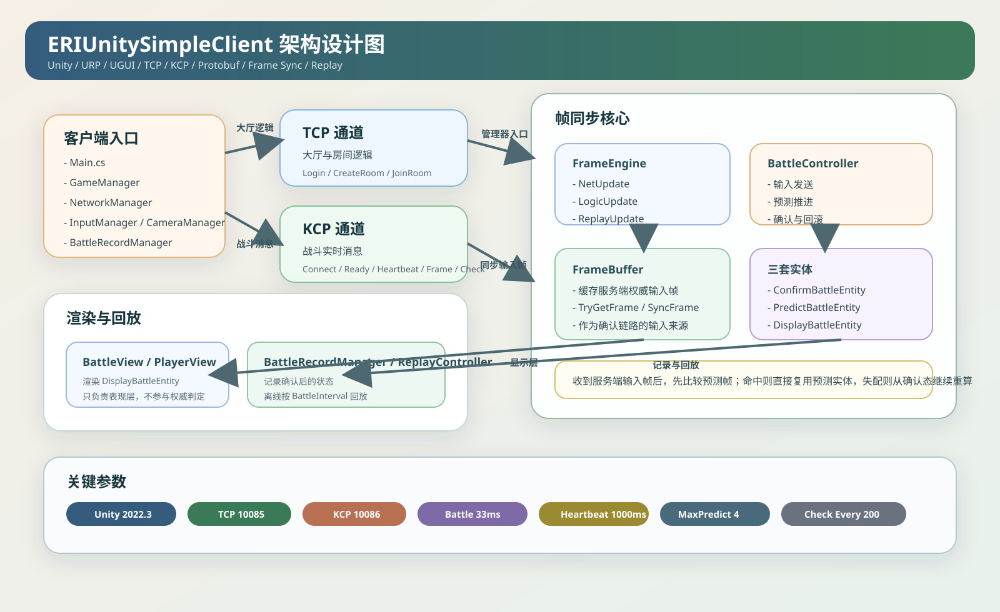

# ERIUnitySimpleClient

这是一个基于 `Unity 2022.3 LTS` 的轻量级帧同步客户端示例，面向 `1v1` 对战场景，采用 `TCP + KCP + Protobuf` 的双通道通信方案。

- `TCP` 负责登录、建房、加房等大厅逻辑
- `KCP` 负责战斗连接、准备、心跳、输入帧同步、校验
- `Protobuf` 负责协议定义与序列化
- `FrameEngine + BattleController` 负责本地预测、确认、回滚与显示同步
- `BattleRecordManager + ReplayController` 负责战斗记录与离线回放

## 技术栈

### 引擎与渲染

- `Unity 2022.3.62f2`
- `URP`
- `UGUI`

### 网络通信

- `TCP`
  用于大厅和房间逻辑
- `KCP`
  用于战斗实时消息
- `ProtoBuf`
  用于逻辑协议与战斗协议

### 帧同步核心

- `FrameEngine`
  驱动网络帧、逻辑帧、回放帧循环
- `BattleController`
  负责输入发送、预测推进、确认同步、回滚重演
- `FrameBuffer`
  缓存服务端返回的权威输入帧
- `ConfirmBattleEntity / PredictBattleEntity / DisplayBattleEntity`
  分别承担确认态、预测态、显示态

## 项目结构

- `Assets/Runtime/`
  全局入口与各类管理器，如 `Main`、`GameManager`、`NetworkManager`
- `Assets/Battle/`
  帧同步战斗核心，包括 `BattleController`、`FrameEngine`、`FrameBuffer`、状态机、系统与视图层
- `Assets/NetCore/`
  TCP/KCP 传输层、缓冲区、包结构与底层网络封装
- `Assets/ProtoGen/`
  `.proto` 协议定义与生成代码
- `Assets/Resources/`
  运行时动态加载资源
- `Assets/Scenes/`
  入口场景 `Main.unity` 与战斗场景 `World.unity`

## 核心流程

1. 客户端启动后初始化 `GameManager`、`NetworkManager`、`InputManager`、`CameraManager`、`BattleRecordManager`
2. 通过 `TCP` 完成登录、建房、加房
3. 房间就绪后切换到战斗场景，通过 `KCP` 建立战斗连接
4. `FrameEngine` 同时驱动：
   - `NetUpdate`：发送输入帧与心跳
   - `LogicUpdate`：处理服务端权威输入帧并执行本地预测
5. `BattleController` 维护三套实体：
   - `ConfirmBattleEntity`：最近一次已确认的逻辑状态
   - `PredictBattleEntity`：在确认态基础上继续向前预测的状态
   - `DisplayBattleEntity`：直接用于渲染的状态
6. 如果服务端返回的输入帧与本地预测帧一致，则直接复用预测结果
7. 如果不一致，则从确认态开始按权威输入重新推进，完成回滚修正
8. 确认后的状态由 `BattleRecordManager` 记录，供 `ReplayController` 离线回放

## 架构图

## 适用场景

- Unity 帧同步客户端原型验证
- 本地预测 + 回滚修正 Demo
- TCP 大厅 + KCP 战斗 的客户端拆分示例
- ProtoBuf 驱动的轻量级联机客户端样例
